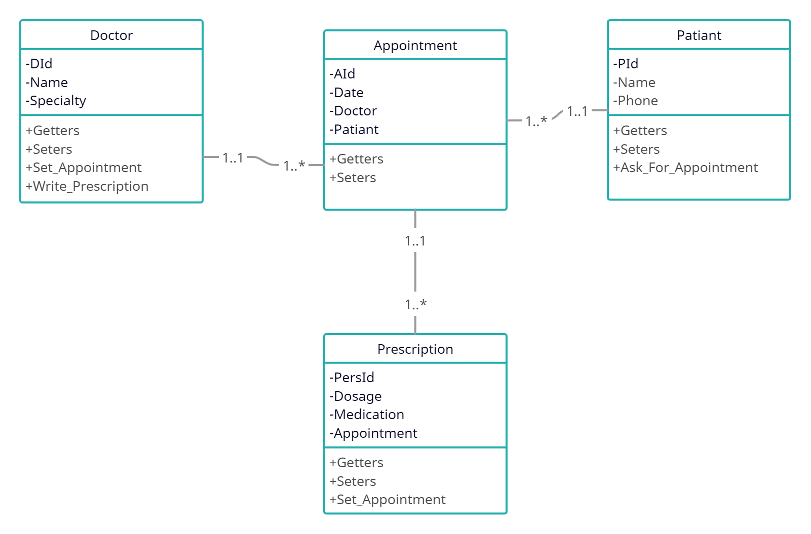

# hospital-management-system
## Introduction
This is a small hospital management API system, that manages doctors with their patients through appointments, 
and assign a prescription if needed

## Table of Contents
- [Introduction](#introduction)
- [UML](#UML)
- [APIs](#APIs)
- - [Doctor](#Doctor)
- - [Patient](#Patient)
- - [Appointment](#Appointment)
- - [Prescription](#Prescription)

## UML
The following png is UML Class Diagram of a small hospital system,
with a docter and patient classes that are connected through an appointment class,
and a prescreption class linked to to that appointment, with the ability to 
schedual another appointment if needed by the prescreption.

## APIs
As for how to use the API, the following are tables that describes the different http requests

## Doctor
| Http  Method| URL Path                        | Http  Status  Code | Description                     | Sample Request                                                            | Sample Response                                                                                                                                                                                               |
|:----------------|:--------------------------------|:---------------------------|:--------------------------------|:--------------------------------------------------------------------------|:--------------------------------------------------------------------------------------------------------------------------------------------------------------------------------------------------------------|
| GET             | /doctors                        | 200/ 404              | Get all  doctors            | GET  /doctors                                                         | json { "id":1, name":"john", "speciality":"eye" }                                                                                                                                             |
| POST            | /doctors                        | 201/ 400              | Create a doctor                 | POST  /doctors { "name":"john", "speciality":"eye" }  | { "id":1, name":"john", "speciality":"eye" }                                                                                                                                                  |
| GET             | /doctors/{id}                   | 200/ 404              | Get Doctor by id                | GET  /doctors/1                                                       | { "id":1, name":"john", "speciality":"eye" }                                                                                                                                                  |
| DELETE          | /doctors/{id}                   | 200/ 404              | Delete doctor by id             | DELETE  /doctors/1                                                    | Deleted successfully                                                                                                                                                                                          |
| GET             | /doctors/{id}/ appointments | 200/ 404              | Get all appointments for doctor | GET  /doctors/{id}/appointments                                       | [ { "id":1, "date":"2023-07-07", "doctor":{ "id":1, "name":"john", "speciality":"eye" }, "patient":{ "id":1, "name":"omar", "phonenum":1234 } } ] |
| PUT             | /doctors/{id}                   | 200/ 404              | Update doctor                   | PUT  /doctors/{1} { "name":"john", "speciality":eye } | { "id":1, "name":"john", "speciality":"eye" }                                                                                                                                                 |

## Patient
| Http  Method | URL Path      | Http  Status  Code | Description           | Sample Request                                                           | Sample Response                                                  |
|:-----------------|:--------------|:---------------------------|:----------------------|:-------------------------------------------------------------------------|:-----------------------------------------------------------------|
| GET              | /patient      | 200/ 404              | Get all  Patients | GET  /Patients                                                       | json { "id":1, name":"john", "phoneNum":"1234" } |
| POST             | /patient      | 201/ 400              | Create a Patient      | POST  /Patients { "name":"john", "phoneNum":"123" }  | { "id":1, name":"john", "phoneNum":"123" }       |
| GET              | /patient/{id} | 200/ 404              | Get Patient by id     | GET  /Patients/1                                                     | { "id":1, name":"john", "phoneNum":"123" }       |
| DELETE           | /patient/{id} | 200/ 404              | Delete Patient by id  | DELETE  /Patients/1                                                  | Deleted successfully                                             |
| PUT              | /patient/{id} | 200/ 404              | Update Patient        | PUT  /Patients/{1} { "name":"john", "phoneNum":123 } | { "id":1, "name":"john", "phoneNum":"123" }      |

## Appointment
| Http  Method | URL Path          | Http  Status  Code | Description               | Sample Request                                                                                   | Sample Response                                                                  |
|:-----------------|:------------------|:---------------------------|:--------------------------|:-------------------------------------------------------------------------------------------------|:---------------------------------------------------------------------------------|
| GET              | /Appointment      | 200/ 404               | Get all  Appointments | GET  /Appointments                                                                           | json { "id":1, name":"john", "speciality":"eye" }                |
| POST             | /Appointment      | 201/ 400              | Create a Appointment      | POST  /Appointments { "date":"2023-01-03", "doctorId":1, "patientId":2 } | { "id":1, "date":"2023-01-03", "doctorId":1, "patientId":2 } |
| GET              | /Appointment/{id} | 200/ 404              | Get Appointment by id     | GET  /Appointments/1                                                                         | { "id":1, "date":"2023-01-03", "doctorId":1, "patientId":2 } |
| DELETE           | /Appointment/{id} | 200/ 404              | Delete Appointment by id  | DELETE  /Appointments/1                                                                      | Deleted successfully                                                             |
| PUT              | /Appointment/{id} | 200/ 404              | Update Appointment        | PUT  /Appointments/{1}{ "date":"2023-01-03", "doctorId":2, "patientId":3 }   | { "id":1, "date":"2023-01-03", "doctorId":2, "patientId":3 } |

## Prescription
| Http  Method | URL Path           | Http  Status  Code | Description                | Sample Request                                                                                          | Sample Response                                                                           |
|:-----------------|:-------------------|:---------------------------|:---------------------------|:--------------------------------------------------------------------------------------------------------|:------------------------------------------------------------------------------------------|
| GET              | /Prescription      | 200/ 404              | Get all  Prescriptions | GET  /Prescription                                                                                  | json { "id":1, dosage":10, "medication":"trufin", "appointmentId":1 } |
| POST             | /Prescription      | 201/ 400              | Create a Prescription      | POST  /Prescription { "dosage":10, "medication":"trufin", "appointmentId":1 }   | { "id":1, dosage":10, "medication":"trufin", "appointmentId":1 }      |
| GET              | /Prescription/{id} | 200/ 404              | Get Prescription by id     | GET  /Prescription/1                                                                                | { "id":1, dosage":10, "medication":"trufin", "appointmentId":1 }      |
| DELETE           | /Prescription/{id} | 200/ 404              | Delete Prescription by id  | DELETE  /Prescription/1                                                                             | Deleted successfully                                                                      |
| PUT              | /Prescription/{id} | 200/ 404              | Update Prescription        | PUT  /Prescription/{1} { dosage":20, "medication":"acamol", "appointmentId":1 } | { "id":1, dosage":20, "medication":"acamol", "appointmentId":1 }      |

,you can also checkout the folder containing the full json api
[Postman](https://github.com/laithisbaitan/hospital-management-system/tree/main/API%20Examples%20as%20JSON%20useing%20postman "API Examples as JSON useing postman")
it has examples for each request for every entity